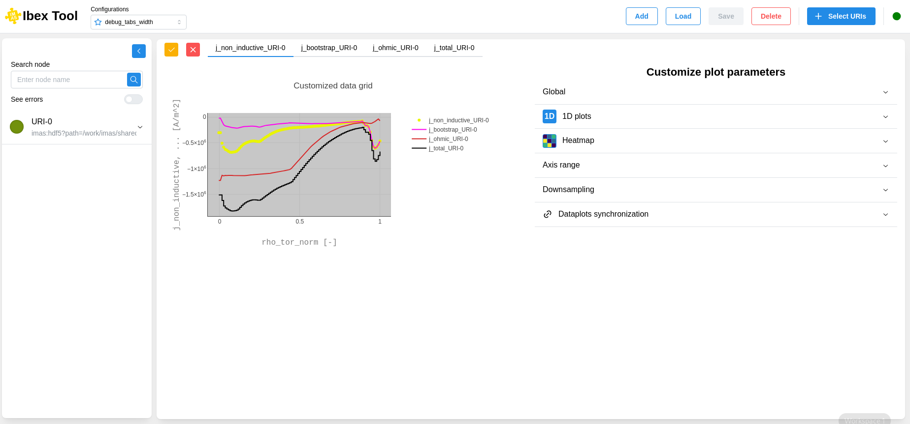
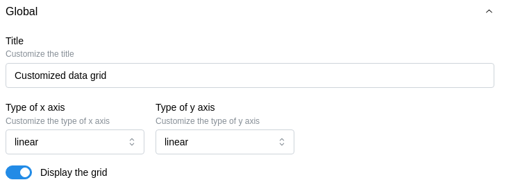
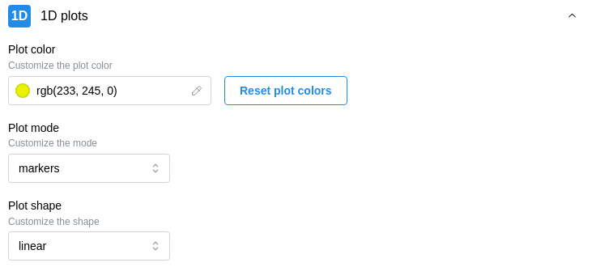
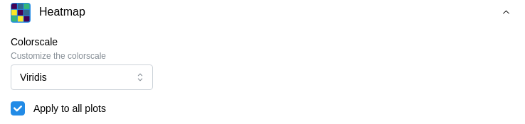
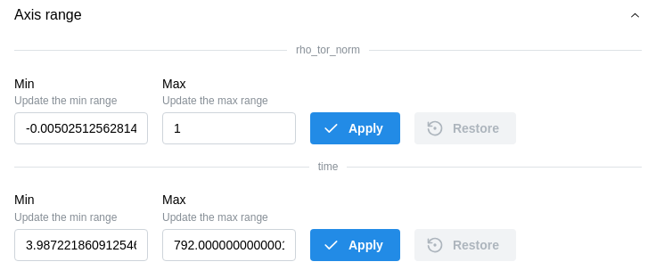
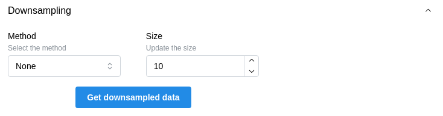
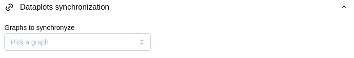

===================
Customization
===================

Overview
--------------------

Here is the customization component:

The customization is divided into sections accessible on the right.

When you make changes, you can see the updates reflected in the graph on the left.

You can undo changes by clicking the button with the red X in the upper-left corner. Otherwise, simply click the button with the orange checkmark to apply the customization.

Global
--------------------

Allows you to modify general parameters of a graph:

1D plots
--------------------

Allows you to customize the appearance of 1D plots:

Heatmap
--------------------

Allows you to modify the color scale of the heatmap:

Axis range
--------------------

Allows you to trim data for a more detailed visualization:

Downsampling
--------------------

Applies a downsampling method to reduce the data size while preserving its original appearance:

Dataplot synchronization
--------------------

Allows you to link plots by their coordinates to facilitate comparison when using sliders:

