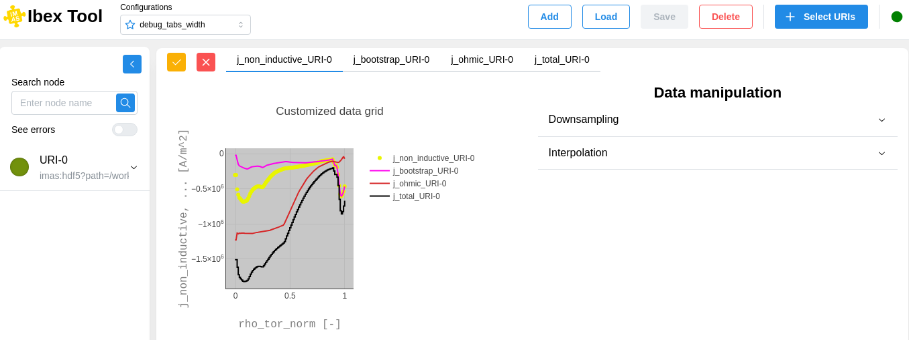
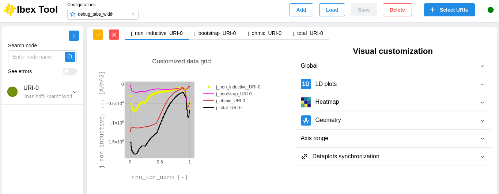
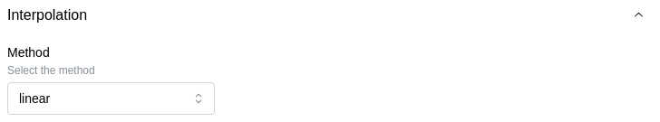
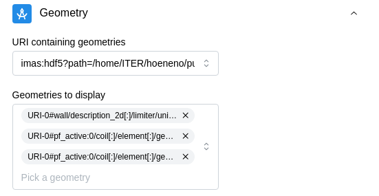

===================
Customization
===================

Overview
--------------------

The customization component is divided into sections accessible on the right.

It is used for data manipulation as well as visual customization. Depending on the type of customization you choose, the corresponding features will be displayed.

Here is the data manipulation:

And here is the visual customization:

When you make changes, you can see the updates reflected in the graph on the left.

You can undo changes by clicking the button with the red X in the upper-left corner. Otherwise, simply click the button with the orange checkmark to apply the customization.

Data manipulation
--------------------

Downsampling
~~~~~~~~~~~~~~~~~~~~~~~~

Applies a downsampling method to reduce the data size while preserving its original appearance:

.. image:: images/customization_downsampling.png
   :alt: Downsampling section of the data manipulation
   :align: center

Interpolation
~~~~~~~~~~~~~~~~~~~~~~~~

Applies an interpolation method to fill gaps between data points by estimating intermediate values:

Visual customization
----------------------------

Global
~~~~~~~~~~~~

Allows you to modify general parameters of a graph:

.. image:: images/customization_global.png
   :alt: Global section of the visual customization
   :align: center

1D plots
~~~~~~~~~~~~

Allows you to customize the appearance of 1D plots:

.. image:: images/customization_1d_plot.png
   :alt: 1D plots section of the visual customization
   :align: center

Heatmap
~~~~~~~~~~~~

Allows you to modify the color scale of the heatmap:

.. image:: images/customization_heatmap.png
   :alt: Heatmap section of the visual customization
   :align: center

Geometry
~~~~~~~~~~~~

Allows you to overlay geometries:

Axis range
~~~~~~~~~~~~

Allows you to trim data for a more detailed visualization:

.. image:: images/customization_axis_range.png
   :alt: Axis range section of the visual customization
   :align: center

Dataplot synchronization
~~~~~~~~~~~~~~~~~~~~~~~~~~~~~~~~~~~~

Allows you to link plots by their coordinates to facilitate comparison when using sliders:

.. image:: images/customization_synchronization.png
   :alt: Synchronization section of the visual customization
   :align: center
