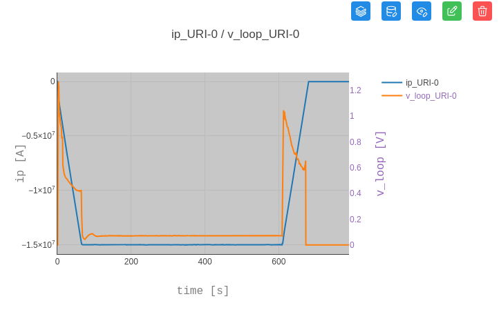
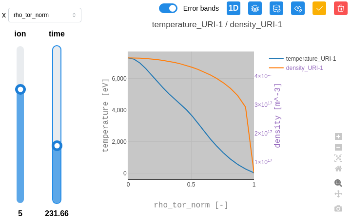
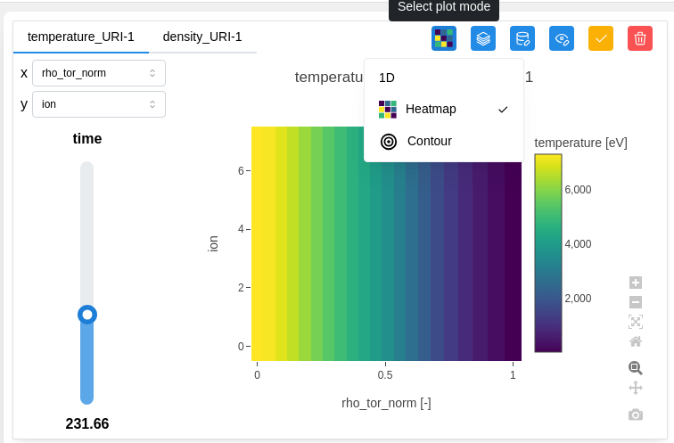
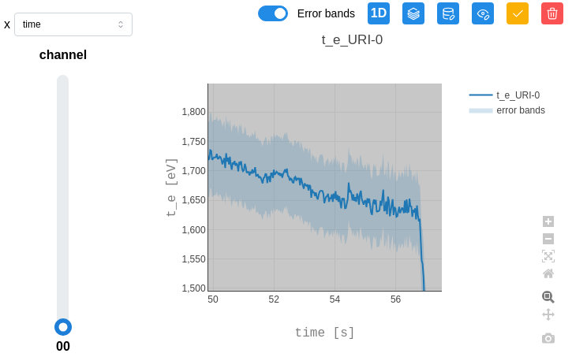

.. _`Plot data`:

===================
Plot data
===================

To plot a data point on a chart, simply click on the corresponding node in the tree. Each node is preceded by a checkbox : you can either click the checkbox or directly click the node name. This will create a component in the draggable area on the right.

You can plot 1D / heatmap / contour charts with one or multiple nodes, as long as they share the same X-axis. Up to two different Y-axes can be displayed simultaneously.

Some data has dependencies represented as sliders. It is possible to explore the data by clicking on the green button to update the graph and adjusting the sliders. It will influence the visualisation of the graphs.

By default, the chart title is generated using the node's name, unit, and associated URI. The Y-axes are labelled with the name of the first plotted plot and their unit. Finally, the X-axis is labeled with the name used to retrieve coordinates and his unit. Each data series is distinguished by a default color.

We can switch to the 1D / heatmap / Contour display by clicking on the corresponding button.

Some data has error bands reprented by "_error_upper" & "_error_lower". These error bands can be visualized by switching on "Error bands" as below:

Some data cannot be plotted and are not visually visible in graph form. They are therefore displayed as ":doc:`Metadata <metadatas>`".

.. image:: images/plot_metadata.png
   :alt: Show metadata according to the unplottable data
   :align: center
