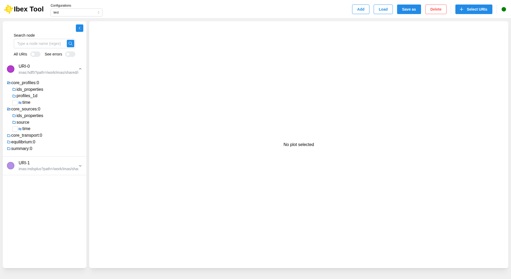

.. _`Tree`:

===================
Tree
===================

After selecting your URIs, you can navigate through the hierarchy to find your data and plot it on a chart.

In each URI, at the first level, you will find the IDS of each occurrence. For each IDS, you will find the corresponding tree.

In this tree, there are different types of data (Structure, Table, Float, Integer, Text, Complex), and each type will have its corresponding icon, except for Structures and Tables, which will share the same icon.

You can collapse the tree view to allow other components to use the full available space.

Search a node
-------------

Type a part of a node path in "Search node" and press Enter to list the matching nodes. Clear the field to go back to the tree as you left it: the nodes checked from the results are revealed in it.

By default, the search only covers the URI opened last. Switch on "All URIs" to search every URI of the configuration at once: each URI that has matches is opened with its own results.

"See errors" also shows the "_error_upper" & "_error_lower" nodes in the tree and in the search results.

Check a node in every URI
-------------------------

To compare the same signal across URIs, hold Ctrl (⌘ on macOS) and click the node: it is checked in every URI that has it, and plotted on the same chart. The folders leading to it are opened along the way. Ctrl+click (⌘+click) a checked node to uncheck it in every URI at once.

A plain click still checks or unchecks the node in its own URI only.
